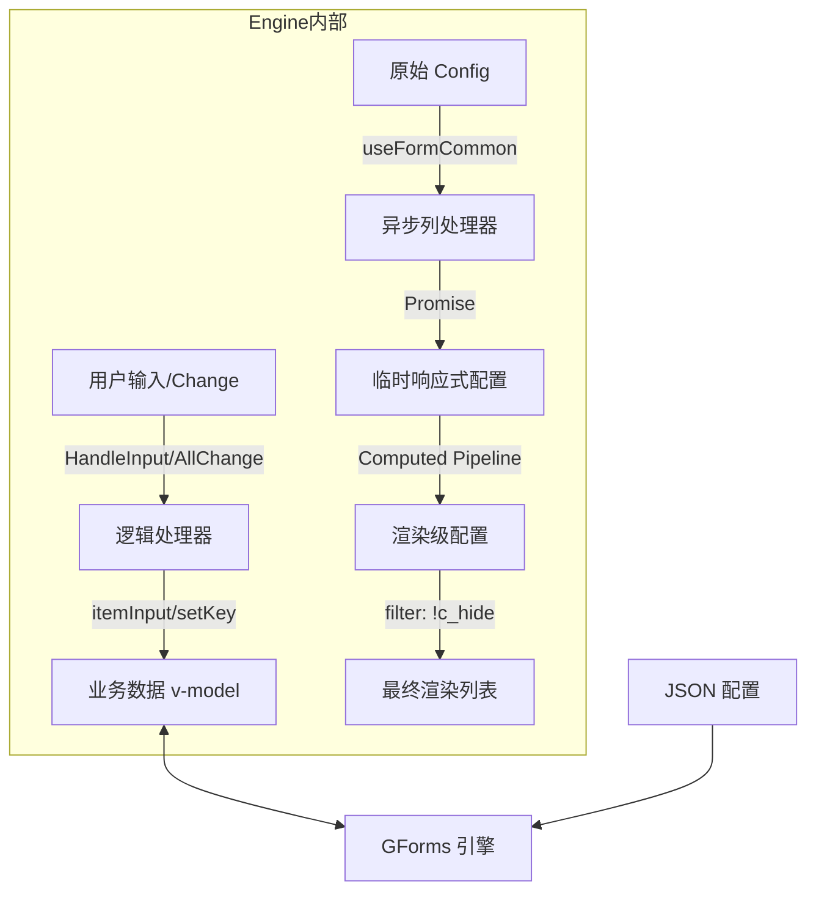

# 🚀 细节拉满：手写一个生产级的 Vue3 配置化表单引擎 (GForms)

> 这是一个关于“如何把表单业务逻辑抽象到极致”的技术分享。我们不仅要“能用”，还要“好用、通用、可扩展”。
> 本文将深度剖析 `GForms` 的源码实现细节，展示如何用 JSON 驱动一个支持**动态显隐、异步回填、复杂联动、自动计算**的高级表单系统。

---

## 1. 为什么我们需要“配置化表单引擎”？

在 B 端业务中，表单是最复杂的重灾区。你是否遇到过以下场景：

1.  **逻辑分散**：字段 A 的显示依赖字段 B，字段 C 的校验依赖字段 A。代码里充满了 `v-if` 和 `watch`，逻辑散落在 template 和 script 各处。
2.  **重复劳动**：每个页面都要写一遍 `<van-field>`, `<van-picker>`, `<van-popup>`，不仅啰嗦，改样式还要全项目搜。
3.  **难维护**：产品说“这个必填校验改一下规则”，你需要在几十行代码里找到那个具体的 `rule`。

**GForms (Generic Forms)** 的核心思想是将**UI 渲染**与**业务逻辑**彻底分离。

- **Engine (GForms)**: 这是一个“黑盒”，它只负责接收配置，处理渲染、事件分发。
- **Config (JSON)**: 这是“指令”，它描述了字段长什么样、怎么动。

---

## 2. 核心架构设计图



---

## 3. 源码级深度剖析：细节决定成败

### 3.1 “计算管道” (Computed Pipeline) —— 动态能力的源泉

很多低代码方案做得很卡，是因为在 render 函数里做了太重的逻辑。GForms 选择利用 Vue 的 `computed` 缓存机制，构建一条**配置处理流水线**。

在 `GForms.vue` 中，我们并没有直接循环 `props.config`，而是循环 `computedConfig`。

**源码精讲：**

```javascript
/* GForms.vue */
const computedConfig = computed(() => {
  return (tempConfig.value || []) // 这里用 tempConfig 是为了支持异步 columns
    .map((item) => {
      const processed = { ...item }; // 浅拷贝，防止污染原始配置

      // [细节1] 动态隐藏的归一化
      // 允许 hide 是 bool，也可以是 (values, item) => bool 的函数
      if (typeof processed.hide === "function") {
        processed.c_hide = processed.hide(props.modelValue, processed);
      } else {
        processed.c_hide = processed.hide;
      }

      // [细节2] 动态 Label
      // 场景：根据业务类型，Label 可能是 "身份证号" 或 "护照号"
      if (typeof processed.label === "function") {
        processed.label = processed.label(props.modelValue, processed);
      }

      // [细节3] 动态 Required (高阶技巧)
      // Vant 等 UI 库通常只支持静态 rules。
      // 我们在中间层拦截，动态计算 required 状态。
      processed.rules = (processed.rules || []).map((rule) => {
        const newRule = { ...rule };
        if (typeof newRule.required === "function") {
          // 注入上下文 ctx，让校验函数能拿到整份表单数据
          newRule.required = newRule.required(props.modelValue[processed.key], {
            values: props.modelValue,
            name: processed.label,
          });
        }
        return newRule;
      });

      return processed;
    })
    .filter((item) => !item.c_hide); // [关键] 在这里过滤，v-for 就不用再写 v-if 了
});
```

**设计哲学**：

- **归一化 (Normalization)**：无论用户配置的是静态值还是函数，经过管道后，Template 层拿到的永远是确定的值 (`c_hide`, `label`)。
- **上下文注入 (Context Injection)**：在执行函数时，始终把 `props.modelValue` 传进去，这是实现“联动”的基础。

### 3.2 异步列与生命周期 (useFormCommon)

普通的下拉框 `columns` 是数组，但高级表单的 `columns` 往往是接口请求，甚至是**依赖其他字段的接口请求**。

`useFormCommon.js` 提供了一个独立的 Hook 专门处理这个脏活。

**源码精讲：**

```javascript
/* src/utils/useFormCommon.js */
const asyncFun = () => {
  // ...省略拷贝逻辑

  tempConfig.value.forEach((item, index) => {
    // 识别 columns 是否为函数
    if (typeof item.columns === "function") {
      // 执行函数，传入当前表单值 (values) 表示依赖
      const result = item.columns(value.value, item);

      // [细节4] Promise 嗅探
      // 既支持直接返回数组，也支持返回 Promise
      if (result && typeof result.then === "function") {
        // 先置空，防止显示旧数据或错误数据
        item.columns = [];
        result.then((res) => {
          // 异步加载完成后，响应式更新 columns
          tempConfig.value[index].columns = res;
        });
      } else {
        tempConfig.value[index].columns = result;
      }
    }
  });
};

// [细节5] 监听级联变化
// 当外部 config 变了，或者表单 value 变了（可能导致依赖的参数变化），都要重新计算
watch(() => config.value, asyncFun, { immediate: true });
```

**实战场景**：
级联选择：当“省份”变化时，`asyncFun` 会重新执行，“城市”字段的 `columns` 函数再次被调用（带着新的省份值），返回新的 Promise，从而自动刷新下拉列表。

### 3.3 自动回填 DSL (Domain Specific Language)

在业务中，选中“供应商”后，往往需要自动填入“供应商编码”、“联系人”、“电话”。
如果用 JS 写 `onChange` 很啰嗦。我们设计了一种微型 DSL：`setKey`。

**配置示例：**

```javascript
{
  key: 'vendorId',
  // 语法：目标字段|来源字段, 固定字段=固定值
  setKey: 'vendorName|name, vendorCode|code, type=external'
}
```

**解析引擎 (`src/utils/directive.js` - vSetData)：**

```javascript
export const vSetData = (arg, value, e) => {
  // 1. 解析字符串
  const mapping = arg.split(",").reduce((obj, item) => {
    // 支持 k=v 语法
    if (item.includes("=")) {
      const [key, fixedVal] = item.split("=");
      obj[key] = { type: "fixed", value: fixedVal };
    } else {
      // 支持 target|source 语法
      const [target, source] = item.split("|");
      // 如果没有 |，则默认 target = source
      obj[target] = { type: "map", key: source || target };
    }
    return obj;
  }, {});

  // 2. 执行赋值
  Object.keys(mapping).forEach((targetKey) => {
    const config = mapping[targetKey];
    // 核心细节：修改的是引用对象 value (即 props.modelValue)
    // Vue3 的 Proxy 机制保证了这里赋值会触发 UI 更新
    if (config.type === "fixed") value[targetKey] = config.value;
    else value[targetKey] = e[config.key];
  });
};
```

**[细节6] 回显恢复 (Restoration)**
这才是最坑的地方：**新建时**是选中触发 `setKey`，但**编辑回显时**用户不操作，关联字段怎么出来？

`useFormCommon.js` 中有一个 `setKey` 方法，专门用于初始化时“根据 value 反查 columns”：

```javascript
// 当 columns 异步加载回来后，或者 value 发生变化时
const setKey = () => {
  configs.forEach((item) => {
    if (item.setKey && item.columns) {
      // 拿着当前的 ID (value.value[item.key]) 去 columns 数组里找对应的行对象
      const matched = item.columns.find((col) => col.value === currentValue);
      if (matched) {
        // 找到了！说明是回显状态，手动触发一次 vSetData
        vSetData(item.setKey, value.value, matched);
      }
    }
  });
};
```

这一步保证了表单在“编辑模式”下，关联数据的完整性。

### 3.4 联动回调的“时序控制”

在 `change` 事件中，我们经常需要拿最新的 `modelValue` 去做计算。但是 `update:modelValue` 和 `change` 的触发顺序在不同组件库中并不太稳定。

`useFormCommon.js` 做了一个防御性编程：

```javascript
const allChange = (e, fun, item, formData) => {
  if (typeof fun === "function") {
    // [细节7] 宏任务延迟
    // 使用 setTimeout(..., 10) 将业务回调推入下一个宏任务
    // 确保 Vue 的响应式更新队列已经 flush，formData 已经是最新值
    setTimeout(() => {
      fun(e, formData, item);
    }, 10);
  }
};
```

---

## 4. 完整配置实战：一个“有生命”的表单

下面这段配置，展示了引擎的全部能力。它不是死的 JSON，它包含逻辑。

```javascript
const complexConfig = [
  // 1. 基础字段
  {
    key: "projectType",
    label: "项目类型",
    is: "van-field-picker",
    columns: [
      { text: "研发", value: "RD" },
      { text: "市场", value: "MKT" },
    ],
  },

  // 2. 动态 Label + 动态显示
  {
    key: "gitRepo",
    // 只有研发才显示仓库地址
    hide: (vals) => vals.projectType !== "RD",
    // label 随状态改变
    label: (vals) => (vals.isOpenSource ? "GitHub 地址" : "GitLab 地址"),
    rules: [{ required: true, message: "必填" }],
  },

  // 3. 异步级联 + 自动回填 DSL
  {
    key: "managerId",
    label: "项目负责人",
    is: "van-field-picker",
    // 异步加载：依赖 projectType 变化
    columns: (vals) => fetchUsersByType(vals.projectType),
    // 选中人后，自动填入 managerName 和 managerEmail
    setKey: "managerName|name, managerEmail|email",
  },

  // 4. 只读回显字段
  {
    key: "managerEmail",
    label: "负责人邮箱",
    readonly: true,
    placeholder: "自动带出",
  },

  // 5. 自动计算 (allInput)
  {
    key: "manDay",
    label: "预估人天",
    type: "number",
    // 每次输入都触发，计算总价
    allInput: (vals) => {
      vals.totalCost = (vals.manDay || 0) * (vals.pricePerDay || 0);
    },
  },
  {
    key: "totalCost",
    label: "预估总成本",
    readonly: true,
    unit: "元",
  },
];
```

---

## 5. 总结与扩展建议

通过 `GForms`，我们将表单开发从 **"写代码"** 变成了 **"写配置"**。

### 这套方案的优势：

1.  **极度解耦**：UI 变动（比如从 Vant 换成 ElementUI），只需要改 `GForms.vue` 一个文件，所有业务逻辑不用动。
2.  **序列化友好**：大部分配置是 JSON，只有少部分函数。如果需要存数据库，可以用字符串存储函数体，前端 `new Function` 还原（注意安全）。
3.  **测试容易**：验证配置逻辑不需要渲染组件，直接跑单元测试验证配置函数的输入输出即可。

### 扩展思路：

如果要把这个引擎做得更强，你可以考虑：

- **Schema 校验**：用 TypeScript 定义 Config 的接口，开发时获得智能提示。
- **插槽支持**：对于极其变态的 UI 需求，在 Config 里增加 `slotName`，在 GForms 里透传 Slot。
- **分组布局**：在 Config 外层增加 `group` 概念，支持折叠面板。

---

> **附：核心文件清单**
>
> - 渲染引擎：`src/components/GForms.vue`
> - 逻辑内核：`src/utils/useFormCommon.js`
> - 指令工具：`src/utils/directive.js`

希望这篇文章能帮你构建出自己的“低代码”表单引擎！ 💪
